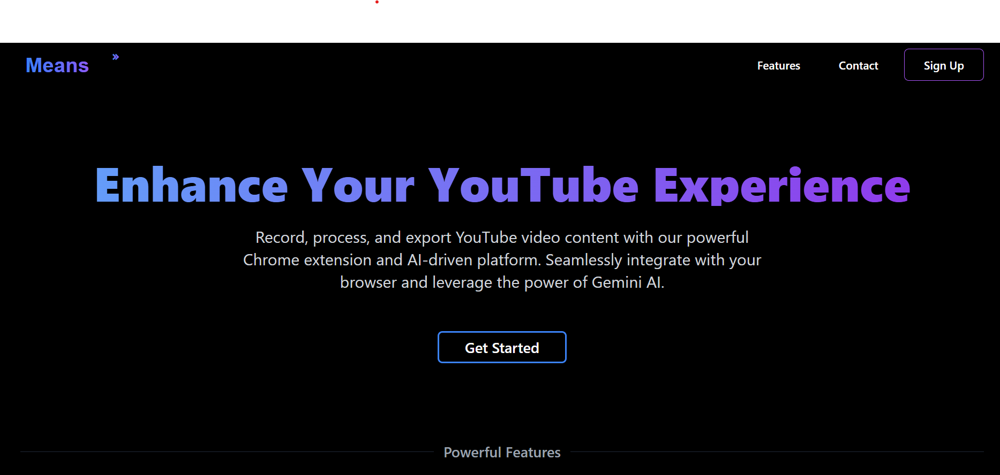

# YouTube Learning Assistant 🎓

## Overview
YouTube Learning Assistant is a powerful learning tool that helps users improve their English vocabulary while watching YouTube videos. Built for the Appwrite Hackathon, this project combines a browser extension with a web application to create an seamless learning experience.


- **Automated Vocabulary Extraction**: Uses Gemini AI to extract and explain medium-level English vocabulary
- **Personal Dashboard**: Track and manage your learning progress
- **Notion Export**: Export your learned vocabulary to Notion
- **Custom API Integration**: Use your own API keys for unlimited learning

## 🏗️ Architecture

### Tech Stack
- **Frontend**: Next.js
- **Authentication**: Appwrite
- **Browser Extension**: Chrome Extension API
- **Video Processing**: yt-dlp-exec
- **AI Integration**: Google Gemini
- **Database**: Mongodb Database

### System Components
1. **Browser Extension**
   - Records video watching history
   - Sends metadata to backend
   - Toggle recording functionality

2. **Web Application**
   - User authentication with Appwrite
   - Dashboard for video history
   - Processing status tracking
   - Settings management

3. **Backend Processing**
   - Video metadata validation
   - Subtitle extraction
   - Vocabulary processing
   - Rate limit management

## 🚀 Installation

### Web Application
```bash
# Clone the repository
git clone https://github.com/gitadityakumar/Means-hf24-codebase

# Install dependencies
cd Means-hf24-codebase
npm install
npm run add
# Set up environment variables for each directory except Extension
cp .env.sample .env

# Run the development server
npm run dev
```

### Chrome Extension
1. Open Chrome and navigate to `chrome://extensions/`
2. Enable Developer Mode
3. Navigate to Extension folder and then  run pnpm dev
4. Go to dist folder inside Extension dir and choose folder .
5. Click "Load unpacked"
6. Select the `extension` directory from the project

### Environment Variables
```env
just copy .env.sample file to .env then add necessary details  mentioned in .env.sample file 
```

### Appwrite Setup
1. Create a new project in Appwrite Console
2. Grab your details mentioned in .env.sample file 


## 💡 Usage

1. **Installation**
   - Install the Chrome extension
   - Sign up on the web application using Appwrite authentication

2. **Recording Videos**
   - Toggle the extension button while watching YouTube videos
   - Videos will appear in your dashboard

3. **Processing Content**
   - Select videos for processing from the dashboard
   - View extracted vocabulary and meanings
   - Export to Notion when ready

4. **Settings**
   - Configure your personal API keys

## 🔐 Security Features
- Secure authentication via Appwrite


Built with ❤️ for the Appwrite Hackathon